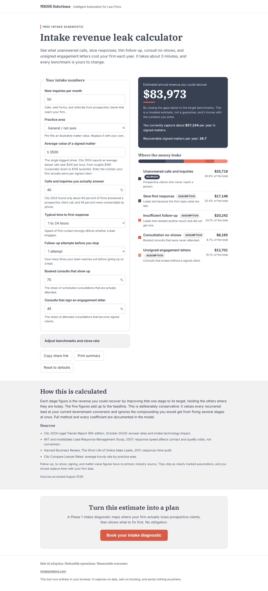

# Intake Revenue Leak Calculator

[](https://github.com/granolacowboy/mhsb-intake-leak-calculator/actions/workflows/ci.yml)
[](https://www.mhsbsolutions.com/tools/intake-revenue-leak-calculator/)
[](./LICENSE)

A standalone, static web tool for mhsbsolutions.com. A law firm owner enters
their intake numbers in about three minutes and sees an estimate of the annual
revenue they could recover by closing intake gaps, broken down across five
stages: unanswered calls, slow first response, insufficient follow-up, consult
no-shows, and unsigned engagement letters.

Zero backend. All computation runs in the browser. No analytics, no tracking, no
email capture, no network calls at runtime. Fonts are self-hosted.

[](https://www.mhsbsolutions.com/tools/intake-revenue-leak-calculator/)

> **Try the production version:** [mhsbsolutions.com/tools/intake-revenue-leak-calculator](https://www.mhsbsolutions.com/tools/intake-revenue-leak-calculator/)

## Model

The math and every coefficient live in [MODEL.md](./MODEL.md). Summary:

- Each stage figure is an **independent single-lever gain**: the revenue
  recoverable by lifting that one stage to its target while holding the others
  at their current values. The five figures sum, by construction, to the
  headline.
- The framing is deliberately conservative (it ignores the compounding of fixing
  several stages at once) so it does not overclaim.
- The one sourced coefficient default is the current 40% answer rate, from the
  Clio 2024 Legal Trends Report (a firm-level mystery-shopper share, labeled as
  such in the UI). Every other coefficient default is marked **ASSUMPTION**,
  badged in the UI, and overridable. MIT 2007 and HBR 2011 support the direction
  of the response stage only; they never enter the math. Nothing unsourced is
  presented as fact.

## Tech

Astro 5 (static) + TypeScript, plain CSS with the MHSB v4.3 brand tokens as
custom properties, vanilla client-side TypeScript (no UI framework). Chosen to
mirror the mhsbsolutions.com stack, the site that serves the live route. Vitest
for the model unit tests, Playwright + axe-core for the smoke and accessibility
tests.

## Quickstart

```bash
npm install
npm run dev        # local dev server
npm run build      # static build to dist/
npm run preview    # serve the build
```

## Verify

```bash
npm run test:unit          # Vitest: model + URL state (22 tests)
npx playwright install chromium   # once, for the browser tests
npm run test:e2e           # Playwright: smoke fills the form and asserts a result; axe checks a11y
npm run lint:brand         # brand banned-phrase / dash / legacy-hex / retired-font lint over client copy
npx astro check            # type check
npm run verify             # unit + build + e2e + brand lint in sequence
```

The GitHub Actions CI workflow runs the same verification path on every pull request and push to `main`, including Chromium-based Playwright smoke and accessibility checks.

## Structure

```
MODEL.md                 the model and its sources (source of truth)
brand-config.json        brand lint configuration (v4.3 values)
scripts/brand_lint.py    vendored config-driven brand lint
scripts/brand-lint.sh    wrapper: lints the copy module + rendered HTML only
src/lib/model.ts         pure, total leak model (framework-free)
src/lib/model.test.ts    unit tests (edge cases, guards, rounding)
src/lib/urlState.ts      shareable URL-encoded state
src/lib/urlState.test.ts unit tests for URL encode/decode round-trips
src/lib/presets.ts       defaults, practice-area presets, helper mappings
src/lib/copy.ts          every client-visible string (brand-lint target)
src/lib/format.ts        Intl money / percent / count formatting
src/lib/ui.ts            client controller (reads form, computes, syncs URL)
src/pages/index.astro    the page (server-renders default results)
src/styles/*.css         tokens, global, print
tests/                   Playwright smoke + a11y specs
docs/                    build log, screenshot
```

## Accessibility and brand

Built to MHSB brand v4.3 (Coral / Slate, white background, dark mode off), using
only the v4.3 verified WCAG pairings. Bright coral is used for non-text accents
only; text and CTAs use pairings that pass WCAG AA. The axe-core suite passes
with zero WCAG A/AA violations. The brand lint (client copy only) is clean.

## Deploy

The tool is live at
https://www.mhsbsolutions.com/tools/intake-revenue-leak-calculator/ as a route on
the mhsbsolutions.com site. This repository is the standalone source it was built
from; it ships as a static build (`npm run build` produces `dist/`). Nothing here
pushes, deploys, or makes network calls: there is no CI or hosting config in the
repo, and promoting a new version or any hosting or DNS change is a deliberate
manual step performed elsewhere.

## License

MIT. See [LICENSE](./LICENSE).